# C2-Server-Backdoor

[+] Disclaimer: This project is only for educational purposes.

Building a backdoor and a C2 server 

Command and Control (C2) Frameworks are an essential part of both Red Teamers and Advanced Adversaries playbooks. They make it both easy to manage compromised devices during an engagement and often help aid in post exploitation steps.

Here we are building a backdoor, using which we can compromise multiple machines and using a simple C2 server we can manage multiple sessions and do many more post exploitation tasks.

This readme file basically showcases the cool features of our tool.

We can also find a malicious image which has the backdoor embedded into it.

We can social enginner our targets into opening this image file & thereby connecting to our C2 server.

In this case we've successfully social engineered our targets into downloading and opening the malicious image file.

In both target machines only the image would be opened. But in the background the target machines connects to our C2 server.

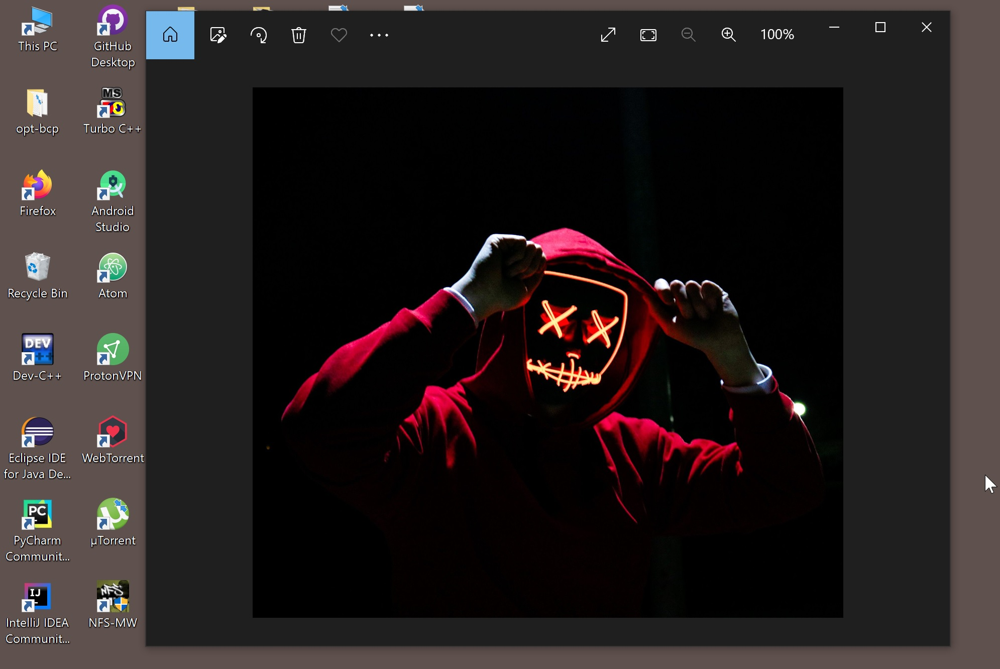

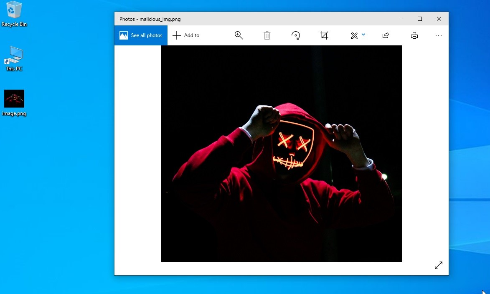

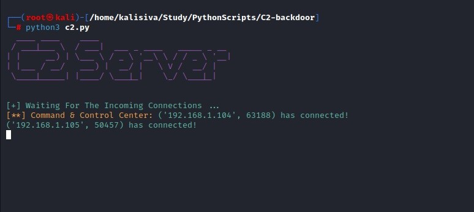

We can do a few things in the C2-Center.

We can list all the available sessions by using the "targets" command.

We can access each sessions by "session #sessionnum", can background a session by "background" command. "sendall" command can be used to execute a command on both the target machines simultaneously. We can kill a session using "kill #sessionnum" command. The image below shows all this.

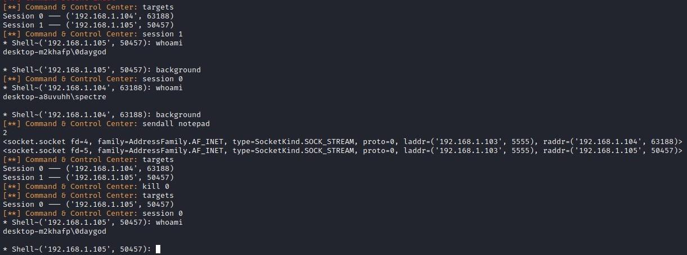

After connecting to a seesion we can use the "help" command to see which all post-exploitation activities we can do.

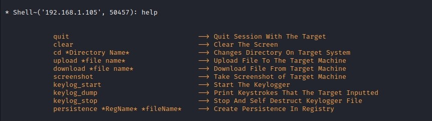

We can upload any file from our attacking machine to the target machine using the command "upload".
Similarly we can download files from the victim machine to our attacking machine using the command "download".
The screenshot command takes the screenshot of the target machine.

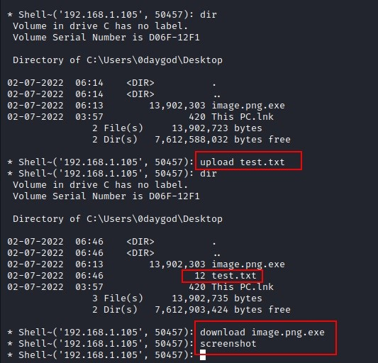

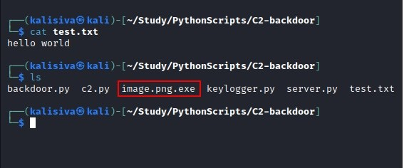

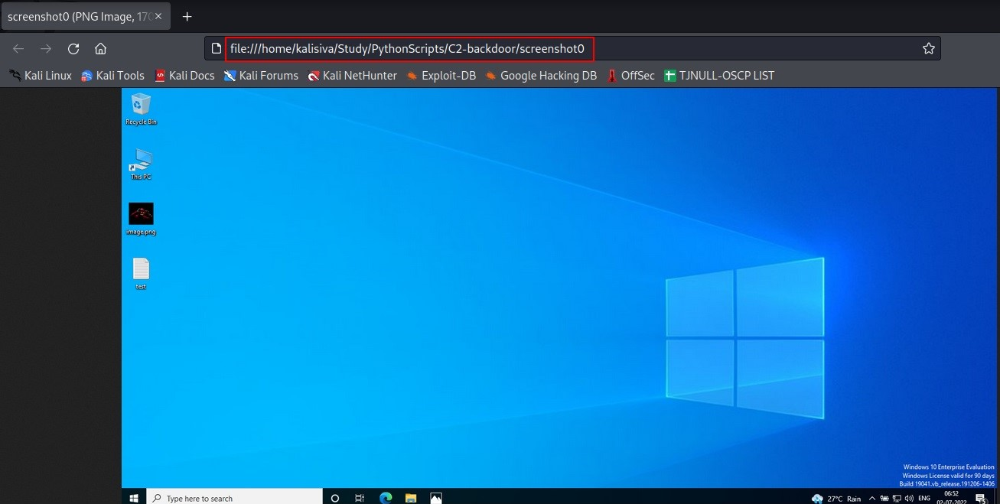

 We can also get the keystrokes typed by the user. The "keylog_start" command starts the keylogger, "keylog_dump" prints the keystrokes of the user & "keylog_stop" stops the keylogger & self-destruct the keylogger file from the target machine.
 
 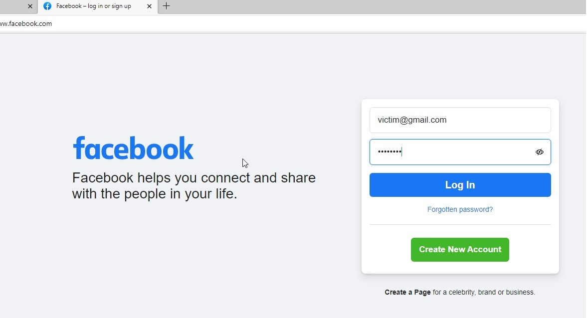
 
 Here the target has logged into his facebook profile using the gmail account and password : password without knowing the keylogger is running in the background.
 
 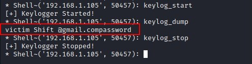
 
 Here we can see the credentials typed by the user from the output of the "keylog_dump" command.
 
 We can also create persistance by hiding our backdoor & adding it to the registry.
 
  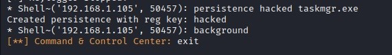
 
  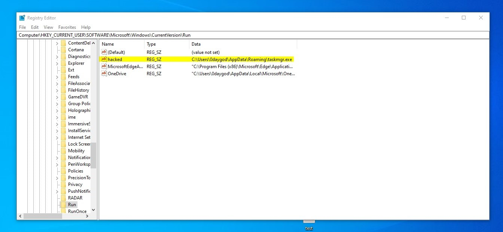
  
  This is by no means an advanced backdoor or server. I've created this project so as to improve/test my scripting skills.
  
  
